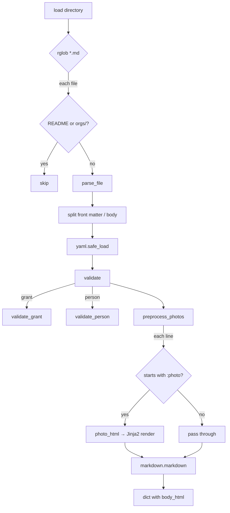

# ContentLoader: A Literate Walk-Through

## What It Does and Why

`ContentLoader` is the intake stage of the faes-website static site
generator. Its job is to turn a directory of Markdown files — each with
a YAML front matter header — into a list of Python dicts that the site
generator can render into HTML pages.

The pipeline it implements is simple but deliberate:

```
content/*.md
    │
    ▼
 read text
    │
    ▼
 split front matter / body
    │
    ▼
 parse YAML   ──► validate fields
    │
    ▼
 preprocess :photo shortcodes
    │
    ▼
 render body Markdown → HTML
    │
    ▼
 dict { title, date, type, public, body_html, … }
```

Each stage is a small, focused method. The design keeps concerns
separated: discovery, parsing, validation, and rendering never bleed
into each other.

---

## Module-Level State: The Jinja2 Environment

Before any class is instantiated, two module-level names are defined:

```python
TEMPLATES_DIR = Path(__file__).parent.parent / "templates" / "html"
env = Environment(loader=FileSystemLoader(TEMPLATES_DIR), autoescape=True)
```

`env` is a shared Jinja2 environment, created once at import time.
Template compilation is expensive; sharing one environment means each
template is compiled only once no matter how many files are processed.

`autoescape=True` is a deliberate safety choice: any user-supplied
string rendered through a template will have HTML special characters
escaped, preventing accidental XSS from content data.

---

## Discovery: Walking the Directory

```python
def load(self, directory: Path) -> list[dict]:
    results = []
    for path in sorted(directory.rglob("*.md")):
        if path.name == "README.md":
            continue
        if (directory / "orgs") in path.parents:
            continue
        results.append(self.parse_file(path, directory))
    return results
```

`rglob("*.md")` descends the entire content tree. Two files are
explicitly excluded:

- **README.md** — convention-driven documentation, not content.
- **orgs/ subtree** — org metadata files follow a different schema
  and are handled by `OrgLoader`, not `ContentLoader`.

The `sorted()` call guarantees deterministic output order regardless
of filesystem ordering, which matters for reproducible builds.

---

## Parsing a Single File

```python
def parse_file(self, path: Path, content_dir: Path) -> dict:
    raw = path.read_text(encoding="utf-8")
    front_matter, body = self.split(raw)
    data = yaml.safe_load(front_matter)
    self.validate(data, path)
    preprocessed = self.preprocess_photos(body, path, content_dir)
    data["body_html"] = markdown.markdown(preprocessed)
    data["source_path"] = path
    return data
```

Notice that `source_path` is injected into the dict alongside the YAML
data. This is bookkeeping: downstream code can trace any rendered page
back to its source file for error messages or debugging.

The two-step body processing — photo shortcodes first, Markdown second
— is intentional. `:photo` lines must be expanded into raw HTML
*before* the Markdown renderer runs, because the Markdown renderer
would otherwise mangle or ignore them.

---

## Splitting Front Matter from Body

Jekyll-style front matter uses `---` as a delimiter. The split logic
handles the two cases a file can be in:

```python
def split(self, raw: str) -> tuple[str, str]:
    if not raw.startswith("---"):
        return "", raw
    parts = raw.split("---", 2)
    return parts[1], parts[2].strip()
```

```
File with front matter:          File without front matter:

---                              Some body text.
title: Hello                          │
---                              ("", "Some body text.")
Body text.

("title: Hello\n", "Body text.")
```

`split("---", 2)` splits at most twice, yielding three parts:
- `parts[0]` — empty string before the opening `---`
- `parts[1]` — the YAML content
- `parts[2]` — the body

Splitting with a limit of 2 means a `---` inside the body (e.g., an
HR in Markdown) never accidentally truncates the content.

---

## Validation: Required Fields and Type Dispatch

Validation is two-level. Every content file must have four universal
fields:

```python
def validate(self, data: dict, path: Path) -> None:
    for field in ("title", "date", "type", "public"):
        if field not in data:
            raise KeyError(f"Missing required field '{field}' in {path}")
    if data.get("type") == "grant":
        self.validate_grant(data, path)
    if data.get("type") == "person":
        self.validate_person(data, path)
```

Then type-specific validators add further constraints:

```python
def validate_grant(self, data: dict, path: Path) -> None:
    if "grant_type" not in data:
        raise KeyError(f"Missing required field 'grant_type' in {path}")
    if data["grant_type"] not in ("pilot", "primary"):
        raise ValueError(f"Invalid grant_type '{data['grant_type']}' in {path}")

def validate_person(self, data: dict, path: Path) -> None:
    if "role" not in data:
        raise KeyError(f"Missing required field 'role' in {path}")
    if data["role"] not in ("board", "advisor"):
        raise ValueError(f"Invalid role '{data['role']}' in {path}")
```

This is an open-for-extension pattern: adding a new content type means
adding one `elif` branch and one new validator method. The error
messages include the file path so authors see exactly which file is
malformed.

---

## Photo Shortcodes: A Mini DSL

The most interesting piece of `ContentLoader` is its small
domain-specific language for embedding photos. Authors write:

```
:photo "beach.jpg", "Sunset at Klein Curaçao", 300, right
```

and the preprocessor expands it into a Jinja2-rendered HTML figure
before Markdown ever sees it.

### Detection

```python
def preprocess_photos(self, body: str, source_path: Path,
                      content_dir: Path) -> str:
    lines = body.splitlines()
    processed = []
    for idx, line in enumerate(lines, start=1):
        if ":photo" not in line:
            processed.append(line)
            continue
        stripped = line.strip()
        if not stripped.startswith(":photo"):
            processed.append(line)
            continue
        processed.append(self.photo_html(stripped, (source_path, idx),
                                         content_dir))
    return "\n".join(processed)
```

The two-stage guard (`":photo" in line` then `stripped.startswith`)
first cheap-filters lines that can't match, then rejects lines where
`:photo` appears mid-line (e.g. in a prose sentence). Only a line that
*starts* with `:photo` (after stripping whitespace) is treated as a
shortcode.

### Parsing the Shortcode

```python
pattern = (
    '^:photo\\s+"([^"\\n]+)"'
    '\\s*,\\s*"([^"\\n]+)"'
    '\\s*,\\s*(\\d+)'
    '\\s*,\\s*(left|right|centered)\\s*$'
)
match = re.match(pattern, raw_line)
```

The regex enforces exact syntax. Each capture group maps to one
argument:

| Group | Captures       | Constraint          |
|-------|---------------|---------------------|
| 1     | filename       | quoted string       |
| 2     | caption        | quoted string       |
| 3     | height         | integer digits only |
| 4     | justification  | enum: left/right/centered |

A failed match raises `ValueError` with a human-readable message
including the file and line number — critical for authors debugging
their content.

### Fallback for Missing Images

```python
image_path = content_dir / "static" / "images" / name
if not image_path.is_file():
    name = "placeholder-image.jpg"
```

Rather than crashing on a missing image, the loader silently swaps in
a placeholder. This lets the site build even when images haven't been
added yet, at the cost of hiding the error from the author.

---

## Public vs. Private Content

```python
def load_public(self, directory: Path) -> list[dict]:
    return [item for item in self.load(directory) if item.get("public") is True]
```

Every content file has a `public: true/false` flag in its front
matter. `load_public` is a thin filter over `load` — it processes all
files and then discards private ones. This is simple but slightly
wasteful: private files are fully parsed and validated even when they
won't be used.

---

## Flow Summary



---

## Observations for Improvement

**1. Silent image fallback hides author errors.**
Swapping a missing image for a placeholder silently is convenient
during development but masks mistakes in production. A `print` warning
or log entry would alert authors without breaking the build.

**2. `split` has a latent `IndexError`.**
If a file starts with `---` but has only one delimiter (malformed
front matter), `parts[2]` will raise `IndexError` with no useful
message. A guard and a clear `ValueError` would be safer:

```python
if len(parts) < 3:
    raise ValueError(f"Malformed front matter in {path}")
```

**3. `validate` uses `if/if` instead of `elif`.**
Two separate `if` checks on `type` always both evaluate. Not a bug
today, but fragile if a type ever needs to match both paths. `elif` is
clearer and more defensive.

**4. `preprocess_photos` guards the same condition twice.**
The `":photo" in line` fast-path and `stripped.startswith(":photo")`
are logically redundant. The first was added for speed; a comment
explaining that intent would prevent a future reader from deleting it
as "obviously dead code."

**5. Module-level `env` is a hidden dependency.**
`photo_html` calls the module-level `env` directly. If a test wants to
swap out the template directory, there is no seam. Moving `env`
construction into `__init__` (or accepting it as an argument) would
make the class fully self-contained and testable in isolation.

**6. `load_public` parses private files it then discards.**
All files are parsed, validated, and their photos preprocessed before
the `public` filter is applied. For large content trees this wastes
work. Reading the `public` flag from YAML before full parsing and
short-circuiting would be faster.
